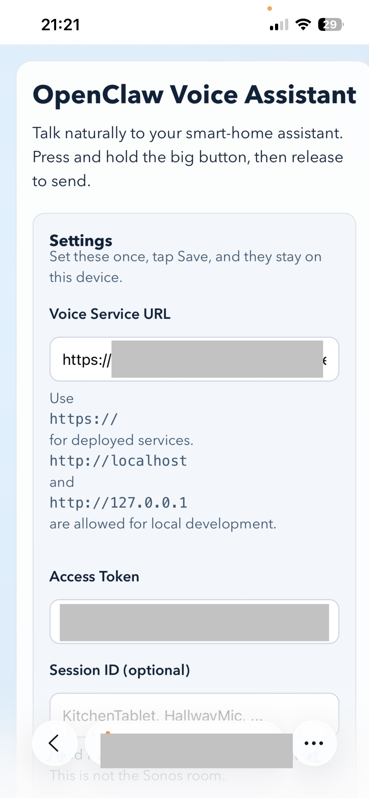
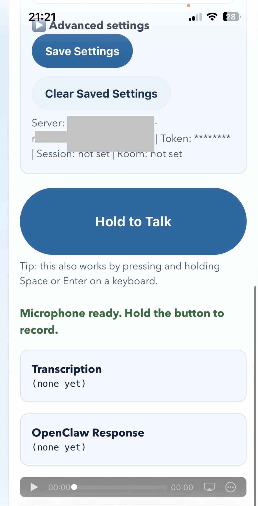

# openclaw-voice

OpenClaw Voice is a voice add-on for OpenClaw. It lets you speak to OpenClaw and hear the reply back on a web page, a desktop computer, or a Sonos speaker.

This repository supports two different kinds of people:

- people who just want to use an OpenClaw Voice setup someone else already runs
- people who want to run the service on their own machine



*Settings page: configure your Voice Service URL, Access Token, and Session ID.*


*Hold to Talk: push-to-talk UI with live transcription and response display.*

## Start here first

If you are a non-technical user, start at `docs/user-guide.md`.

Do not use deployment/operator guides unless you are the person running the server.
If someone else hosts your setup, stay on the browser-use path.

Choose one path and ignore the others for now.

## Self-hosting decision check

Read this before you open any setup guide:

| If this sounds like you... | Choose this path |
| --- | --- |
| I just want to talk to OpenClaw in a browser and do not want to install anything. | Stop here and use `docs/user-guide.md`. |
| I can follow copy-and-paste terminal steps, install software, edit a `.env` file, and spend about 30 to 60 minutes on first-time setup. | Use `docs/host-it-yourself.md`. |
| I already have the server working on my own machine and now want it reachable from another device. I am comfortable keeping a terminal open and spending another 20 to 40 minutes on background service and tunnel steps. | Use `docs/deployment-guide.md`. |
| I want a production-style server on a VPS with my own domain, HTTPS, and restart-safe services. | Use `docs/vps-deployment-guide.md`. |

If terminal commands, config files, or troubleshooting feel out of bounds for you, the browser guide is the right stopping point.

- I only want to talk to OpenClaw in my browser: go to `docs/user-guide.md`
- I want to run OpenClaw Voice on my own computer: go to `docs/host-it-yourself.md`
- I want it to stay running and work from another device: go to `docs/deployment-guide.md`
- I want a VPS + domain deployment with Caddy and `systemd`: go to `docs/vps-deployment-guide.md`
- I want an always-on desktop client with wake word or hotkey: go to `docs/desktop-client-walkthrough.md`
- I am already set up and only need setting explanations: go to `docs/env-reference.md`

## Which one are you?

```text
Do you want to use an existing OpenClaw Voice link?
|
+-- Yes -> Read docs/user-guide.md
|
+-- No -> Do you want to host the service yourself?
          |
          +-- Yes -> Read docs/host-it-yourself.md
          |
          +-- No, I only need the always-on desktop client -> Read docs/desktop-client-walkthrough.md
```

## Quick Start — VPS + Tailscale HTTPS + browser push-to-talk

The fastest path from a fresh Ubuntu/Debian VPS to HTTPS push-to-talk in your browser.
Assumes [Tailscale](https://tailscale.com/download/linux) is already installed and connected on the VPS.

```bash
git clone https://github.com/brokemac79/openclaw-voice.git
cd openclaw-voice
npm install
python3 -m venv .venv && source .venv/bin/activate
pip install faster-whisper
cp .env.example .env
# Edit .env — set VOICE_API_BEARER_TOKEN and OPENCLAW_URL at minimum
sudo apt install -y caddy
# Edit /etc/caddy/Caddyfile — replace its contents with:
#   your-machine.ts.net { reverse_proxy localhost:8787 }
sudo systemctl reload caddy
npm run dev
```

Once the server is running, open `https://your-machine.ts.net` in any Tailscale-connected browser,
allow microphone access, and hold **Hold to talk** to speak.

> Caddy fetches a Tailscale HTTPS certificate for your `*.ts.net` hostname automatically —
> no manual cert management needed.

For a persistent `systemd` service setup, see `docs/vps-deployment-guide.md`.

## What you can do with this

- Talk to OpenClaw by voice in your browser with push-to-talk.
- Run it on your own machine so your speech pipeline stays local.
- Hear replies on your computer and optionally play them on Sonos.
- Keep an always-on desktop client running with wake word, hotkey, or manual trigger.
- Send proactive spoken alerts (for example doorbell, reminders, or energy events).

## Start here by audience

- If terminal commands are not your thing, start at `docs/just-use-it.md`.
- Non-technical landing page with three paths: `docs/just-use-it.md`
- Browser guide (quick start + troubleshooting): `docs/user-guide.md`
- Host it yourself: `docs/host-it-yourself.md`
- Desktop client operators: `docs/desktop-client-walkthrough.md`
- Need every `.env` setting explained: `docs/env-reference.md`

## Choose your setup

Pick the smallest setup that matches what you want to do.

| Setup | Best for | What you need | Start here |
| --- | --- | --- | --- |
| Browser-only | Someone who just wants push-to-talk in a web page | Running voice server, browser mic access, token | `docs/user-guide.md` |
| Browser + local speech | Self-hosters who want speech-to-text on their own machine | Browser-only setup plus a configured STT provider (`faster-whisper` by default; see `STT_PROVIDER` in `docs/env-reference.md`) | `docs/host-it-yourself.md` |
| Desktop + wake word | Always-on desk or mini-PC setups | Local server plus desktop client, `sox`, optional Porcupine wake word files | `docs/desktop-client-walkthrough.md` |
| Sonos playback | Homes/offices that want spoken replies on Sonos | Any setup above plus an external Sonos relay service | `docs/user-guide.md` and `docs/env-reference.md` |

## How voice flows

```text
You speak -> speech-to-text -> OpenClaw -> text-to-speech -> audio reply
```

## End-user documentation

- See `docs/just-use-it.md` for the primary non-technical entry point.
- See `docs/user-guide.md` for the primary end-user browser path and troubleshooting.
- See `docs/desktop-client-walkthrough.md` for the desktop client end-to-end flow.
- See `docs/host-it-yourself.md` for beginner-friendly hosting steps.
- See `docs/deployment-guide.md` for keeping the service running and reachable from other devices.
- See `docs/vps-deployment-guide.md` for Ubuntu/Debian VPS deployments with Caddy and `systemd`.
- See `docs/env-reference.md` for a variable-by-variable `.env` guide.

## For developers: implementation details

- Pluggable STT provider system (`STT_PROVIDER`): `faster-whisper` (default, local), `browser` (Web Speech API, no server audio), `openai-whisper`, `google`, `deepgram`, `vosk` (offline), `azure`
- Sonos output integration through a local HTTP relay endpoint
- Shared `sonos-relay-lib.js` exports: `buildSoapEnvelope`, `sendSoapAction`, `setSonosUri`, `playSonos`, `escapeXml` for relay service implementations
- Desktop client (`npm run desktop:client`) for non-browser usage
- Wake word activation (`Hey OpenClaw`) via Picovoice Porcupine
- Global hotkey fallback trigger when wake word is unavailable
- Wake confirmation beep on trigger
- Proactive Sonos alert endpoint (`POST /api/voice/alerts`) for doorbell/calendar/energy events
- Ambient desktop loop mode for always-on background capture
- Switchable TTS providers (`TTS_PROVIDER=edge|piper|auto`) with Piper fallback support; markdown stripped before synthesis on all TTS paths
- Voice-optimised system prompt (`OPENCLAW_VOICE_SYSTEM_PROMPT`) injected on CLI fallback turns to avoid markdown in spoken replies
- Dual-relay support for Sonos migration (`SONOS_RELAY_URL` / `SONOS_RELAY_PI_URL` + `SONOS_RELAY_FALLBACK_URL`)

## Prerequisites (single checklist)

Use this as the one place to confirm what must be installed before setup.

Core requirements:

- Node.js 20+
- npm (comes with Node.js)
- `.env` created from `.env.example`
- `VOICE_API_BEARER_TOKEN` and `OPENCLAW_URL` configured

Speech pipeline requirements:

- Python 3.10 or later + pip
- `faster-whisper` Python package
- `ffmpeg` (audio decode dependency used by faster-whisper)

Desktop client recording requirement:

- `sox` installed on the machine running `npm run desktop:client`

Optional features (install only if you use them):

- Piper CLI + downloaded `.onnx` voice model (`PIPER_MODEL_PATH`)
- Picovoice account + `PORCUPINE_ACCESS_KEY` + keyword `.ppn` file
- Local Sonos relay service reachable by `SONOS_RELAY_URL` or `SONOS_RELAY_PI_URL`

## Quick start (server)

Node requirement: `>=20`.

If you only want to talk to OpenClaw in a browser, stop here and use `docs/user-guide.md` instead.

1. Install Node dependencies:

   ```bash
   npm install
   ```

2. Create environment file:

   ```bash
   cp .env.example .env
   ```

3. Complete the local faster-whisper Python setup:

   ```bash
   # See the "faster-whisper Python setup (beginner-friendly)" section below.
   ```

4. Fill required `.env` values:

    - `VOICE_API_BEARER_TOKEN`
    - `OPENCLAW_URL` (must be an `http://` or `https://` endpoint; do not use `ws://` or `wss://`)

    Example minimum values:

    ```env
    VOICE_API_BEARER_TOKEN=mytoken123
    OPENCLAW_URL=http://192.168.1.10:3000/api/chat
    OPENCLAW_METHOD=POST
    OPENCLAW_INPUT_FIELD=input
    OPENCLAW_OUTPUT_FIELD=response
    ```

     - `VOICE_API_BEARER_TOKEN`: choose any password-like string yourself, such as `mytoken123`. It just needs to match anywhere else you enter it.
     - `OPENCLAW_URL`: use the upstream HTTP API endpoint, never `ws://`. If upstream shows `ws://192.168.1.10:18789`, keep host `192.168.1.10` and set the matching `http://...` chat endpoint such as `http://192.168.1.10:3000/api/chat`.

     Token placement rule:

     - `VOICE_API_BEARER_TOKEN` is the token browser/desktop clients send to this app.
     - `OPENCLAW_AUTH_BEARER` (optional) is the token this app sends to upstream OpenClaw.
     - Do not assume one token works for both.

     Upstream quick check before starting this app:

     ```bash
     curl -X POST "$OPENCLAW_URL" \
       -H "Content-Type: application/json" \
       -H "Authorization: Bearer $OPENCLAW_AUTH_BEARER" \
       -d '{"input":"ping"}'
     ```

     If this call returns JSON, your upstream URL/token pairing is likely correct.

     If `OPENCLAW_URL` is a `/v1/...` endpoint and you get `403 missing scope: operator.read` (or `operator.write`) on OpenClaw `2026.3.28`, enable the local CLI fallback:

     ```env
     OPENCLAW_CLI_FALLBACK_ENABLED=true
     OPENCLAW_CLI_BIN=openclaw
     OPENCLAW_CLI_SESSION_ID=openclaw-voice
     # optional
     OPENCLAW_CLI_AGENT=
     ```

     This keeps token auth for the voice API while routing upstream turns through `openclaw agent --local --json` until the upstream `/v1` scope regression is fixed.

     Gateway-restart safety in CLI fallback mode:

     - If a turn includes `systemctl --user restart openclaw-gateway`, the server runs that turn in an isolated one-shot session id so your primary session id is not terminated.
     - Chained restart commands (for example `systemctl --user restart openclaw-gateway && curl ...`) are rejected with a clear warning because the restart terminates the active session before chained commands can continue.

      Need a plain-English walkthrough for finding the real upstream URL and token requirements? Use `docs/host-it-yourself.md#how-do-i-find-my-real-openclaw-url`.

5. Start server:

   ```bash
   npm run dev
   ```

6. Open `http://localhost:8787` and use the web client.

## faster-whisper Python setup (beginner-friendly)

This section applies when `STT_PROVIDER=faster-whisper` (the default). If you are using a different STT provider, skip this section and see `docs/env-reference.md` for that provider's setup.

If you have never installed Python tooling before, follow these steps exactly on the same machine that runs the Node server.

### 1) Install Python 3.10 or later and pip

- Python download page: <https://www.python.org/downloads/>
- pip installation/upgrade docs: <https://pip.pypa.io/en/stable/installation/>

Verify both commands work:

- `python3 --version` should report Python 3.10 or newer.

```bash
python3 --version
python3 -m pip --version
```

If `python3 -m pip --version` fails, install pip first, then re-run the check.

### 2) Create and activate a virtual environment (recommended)

From the project root, use the activation command that matches your terminal:

macOS/Linux:

```bash
python3 -m venv .venv
source .venv/bin/activate
python3 -m pip install --upgrade pip
```

Windows Command Prompt:

```cmd
py -m venv .venv
.venv\Scripts\activate.bat
py -m pip install --upgrade pip
```

Windows PowerShell:

```powershell
py -m venv .venv
.venv\Scripts\Activate.ps1
py -m pip install --upgrade pip
```

Why: this keeps Python packages for this project isolated from system-wide packages.

### 3) Install ffmpeg (required for many audio files)

`faster-whisper` relies on ffmpeg for decoding common input formats.

- macOS (no PATH editing): `brew install ffmpeg`
- Ubuntu/Debian: `apt` is usually already installed. Run `sudo apt install ffmpeg`.
- Fedora/RHEL: `sudo dnf install -y ffmpeg`
- Windows (no PATH editing): `winget install --id Gyan.FFmpeg -e`

Fallback if package manager install is not available: download a ZIP build from <https://ffmpeg.org/download.html> and run ffmpeg by full path (for example `C:\ffmpeg\...\ffmpeg.exe -version`) without editing PATH.

Verify it is available:

```bash
ffmpeg -version
```

### 4) Install faster-whisper

```bash
python3 -m pip install faster-whisper
```

If you run OpenClaw Voice under `systemd`, do not point the service at a shell-only virtualenv activation.
Use an absolute Python path that the service can execute at boot:

```env
FASTER_WHISPER_PYTHON_BIN=/opt/openclaw-voice/.venv/bin/python3
```

Install `faster-whisper` into that same interpreter (example on Linux VPS):

```bash
sudo -u openclaw /opt/openclaw-voice/.venv/bin/python3 -m pip install --upgrade pip
sudo -u openclaw /opt/openclaw-voice/.venv/bin/python3 -m pip install faster-whisper
```

Why: `systemd` starts with a minimal environment and does not run your interactive shell profile, so relying on `source .venv/bin/activate` is fragile for always-on services.

### 5) Expect model download on first transcription

The first transcription downloads the selected model and caches it on disk.

- `tiny.en`: roughly 75 MB
- `base.en`: roughly 140 MB (default)
- `small.en`: roughly 460 MB

The first run can take longer depending on your network speed.

### 6) Recommended CPU-only defaults

For most CPU-only machines, start with:

```env
FASTER_WHISPER_MODEL=base.en
FASTER_WHISPER_DEVICE=cpu
FASTER_WHISPER_COMPUTE_TYPE=int8
```

If your machine is very resource-constrained, try `FASTER_WHISPER_MODEL=tiny.en` for faster/cheaper transcription with lower accuracy.

### 7) Run a standalone smoke test

Create your own short sample file so you do not need a pre-existing `test.wav`:

```bash
ffmpeg -f lavfi -i "anullsrc=r=16000:cl=mono" -t 2 test.wav
```

What this does: makes a 2-second silent WAV file in the project root.

Then run:

```bash
python3 scripts/faster_whisper_transcribe.py --audio-path test.wav --model base.en
```

Expected result: JSON printed to stdout (with `text`, `language`, and `duration`) and no Python traceback.

## Verify your setup (before full end-to-end)

Run this checklist in order so each layer is validated before the next one.

1) Service health endpoint:

```bash
curl http://localhost:8787/health
```

Expected: `{"ok":true,"sttProvider":"faster-whisper","ttsProvider":"edge",...}`

`curl` is a terminal command available by default on macOS, Linux, and Windows 10+. If you prefer, open `http://localhost:8787/health` in your browser instead - you should see `{"ok":true}`.

2) Browser microphone capture:

- Open `http://localhost:8787` in your browser.
- Allow microphone permission when prompted.
- Hold **Hold to talk**, speak a short phrase, release.
- Confirm transcription text appears in the UI.

3) OpenClaw upstream connectivity (direct curl):

Use your actual upstream endpoint and payload shape. Example:

```bash
curl -X POST "$OPENCLAW_URL" \
  -H "Content-Type: application/json" \
  -H "Authorization: Bearer $OPENCLAW_AUTH_BEARER" \
  -d '{"input":"ping"}'
```

Expected: a normal OpenClaw response payload (not timeout/auth errors).

4) Sonos relay health (if Sonos is enabled):

```bash
curl http://localhost:8787/api/sonos/relay/health \
  -H "Authorization: Bearer <VOICE_API_BEARER_TOKEN>"
```

Expected: configured relay(s) reported reachable.

5) Desktop client manual-mode verification:

- Set `VOICE_CLIENT_WAKE_MODE=manual` in your desktop client environment.
- Run `npm run desktop:client`.
- Press Enter to record a short turn.
- Confirm transcription + response print in terminal before enabling wake-word mode.

## Desktop client prerequisites

Advanced / optional: skip this whole section unless you want the always-on desktop client.

Before running `npm run desktop:client`, confirm these requirements.

Important: the desktop client is a Node.js terminal CLI process. It is not a packaged desktop app (for example Electron).

### Platform support

- macOS: supported for wake word, hotkey, and manual modes.
- Linux: supported for wake word and manual modes. Global hotkeys require a desktop session with system-wide keyboard capture permissions.
- Windows: supported for wake word, hotkey, and manual modes in a normal desktop session.
- Headless/server-only sessions: not recommended for hotkeys because there is no active desktop keyboard session to capture.

### Install `sox` for recording (required)

`VOICE_CLIENT_RECORD_COMMAND` defaults to a `sox` command, so `sox` must be installed on the machine that runs the desktop client.

- macOS (Homebrew): `brew install sox`
- Ubuntu/Debian: `sudo apt-get update && sudo apt-get install -y sox libsox-fmt-all`
- Fedora/RHEL: `sudo dnf install -y sox`
- Windows (Chocolatey): `choco install sox.portable -y`

Windows note: use `-t waveaudio default` for the record command (the desktop client now auto-corrects legacy `sox -d ...` values on Windows).

- Windows record command: `VOICE_CLIENT_RECORD_COMMAND=sox.exe -q -t waveaudio default -c 1 -r 16000 "{output}" trim 0 5`

### Local playback command examples (optional)

Set `VOICE_CLIENT_PLAY_COMMAND` only if you want the desktop machine to play generated reply audio locally after each turn.

- macOS: `VOICE_CLIENT_PLAY_COMMAND=afplay "{output}"`
- Linux: `VOICE_CLIENT_PLAY_COMMAND=mpg123 "{output}"`
- Windows: `VOICE_CLIENT_PLAY_COMMAND=powershell -NoProfile -NonInteractive -WindowStyle Hidden -Command "$p=New-Object -ComObject WMPlayer.OCX; $m=$p.newMedia('{output}'); $p.currentPlaylist.appendItem($m); $p.controls.play(); while($p.playState -ne 1){Start-Sleep -Milliseconds 200}"`

Tip: the reply file is written as `.mp3`, so pick a playback command that supports MP3 on your machine.

Windows tip: the desktop client now defaults to a hidden Windows Media Player COM playback command when `VOICE_CLIENT_PLAY_COMMAND` is unset, and auto-rewrites legacy `Start-Process` values to that silent command.

### Porcupine prerequisites (wake word)

Advanced / optional: skip this unless you want hands-free wake word detection.

Wake word mode requires Picovoice setup in addition to npm dependencies.

1. Create a Picovoice account at <https://console.picovoice.ai/>.
2. Generate an AccessKey in the Picovoice console and set `PORCUPINE_ACCESS_KEY`.
3. Create or select your wake keyword in Picovoice and download the `.ppn` keyword file for your target platform.
4. Set `VOICE_CLIENT_PORCUPINE_KEYWORD_PATH` to the absolute path of that `.ppn` file.
5. Optional: set `VOICE_CLIENT_PORCUPINE_MODEL_PATH` when using a non-default Porcupine model.

### Linux hotkey caveat (Wayland vs X11)

Global hotkey support depends on whether your desktop environment allows global key capture:

- X11 sessions usually work with the default hotkey listener.
- Wayland sessions may block global key capture by design, depending on compositor and policy.

If hotkey setup fails on Linux, keep wake word enabled or set `VOICE_CLIENT_WAKE_MODE=manual` as a fallback.

## Desktop client (persistent process)

Run the CLI-based desktop client:

```bash
npm run desktop:client
```

Default behavior:

- detect wake phrase using Porcupine (if configured)
- support global hotkey fallback (`Ctrl+Shift+Space` by default)
- keep Enter-to-record as a manual fallback
- send to `/api/voice/turn`
- print transcription + response
- save reply audio to temp directory
- optional local playback when `VOICE_CLIENT_PLAY_COMMAND` is configured

The client is designed to run continuously (for example under `systemd`, `pm2`, or a startup script).

### Wake word setup

To enable the default `Hey OpenClaw` wake flow on the desktop client:

1. Install dependencies with `npm install` so the Porcupine and global hotkey packages are available.
2. Copy `.env.example` to `.env` if you have not already done so.
3. Set `PORCUPINE_ACCESS_KEY` to your Picovoice access key.
4. Set `VOICE_CLIENT_PORCUPINE_KEYWORD_PATH` to the absolute path of your `.ppn` keyword file.
5. Optional: set `VOICE_CLIENT_PORCUPINE_MODEL_PATH` if you are using a non-default Porcupine model file.
6. Leave `VOICE_CLIENT_WAKE_MODE=auto` to prefer wake word and fall back to hotkey/manual entry, or set it to `wake-word`, `hotkey`, `manual`, or `ambient` for stricter behavior.

Recommended operator notes:

- Keep `VOICE_CLIENT_WAKE_BEEP_ENABLED=true` so users hear confirmation before speaking.
- Leave `VOICE_CLIENT_HOTKEY_ENABLED=true` and adjust `VOICE_CLIENT_HOTKEY_KEY` / `VOICE_CLIENT_HOTKEY_MODIFIERS` if you want a fallback trigger.
- Use `VOICE_CLIENT_WAKE_COOLDOWN_MS` to prevent repeated accidental triggers.
- On Linux, the global hotkey listener expects a desktop session that supports system-wide key capture.

### Ambient mode setup

Use ambient mode when the desktop client should wake itself on a timer instead of waiting for a wake word or hotkey.

1. Set `VOICE_CLIENT_WAKE_MODE=ambient` for strict ambient polling, or keep `VOICE_CLIENT_WAKE_MODE=auto` and set `VOICE_CLIENT_AMBIENT_MODE=true` if you want ambient capture enabled alongside the normal client behavior.
2. Set `VOICE_CLIENT_AMBIENT_INTERVAL_MS` to the delay between captures. Keep it at `1000` or higher.
3. Leave `VOICE_CLIENT_AMBIENT_AUTO_START=true` if the loop should begin immediately at process start.
4. Start the client with `npm run desktop:client` and confirm you see `Ambient loop active.` in the terminal.

Ambient mode still keeps manual Enter-triggered recording available in the terminal.

### Piper TTS setup

Advanced / optional: skip this unless you want local Piper speech output or a fallback when Edge TTS is unavailable.

Use Piper when you want local speech synthesis or a fallback when Edge TTS is unavailable.

1. Install Piper from the official release source: <https://github.com/rhasspy/piper/releases>.
2. Download a voice model (`.onnx`) from Piper voices (for example: <https://huggingface.co/rhasspy/piper-voices>). Typical model filenames look like `en_US-lessac-medium.onnx`.
3. Set provider + model variables:

   ```bash
   TTS_PROVIDER=piper
   PIPER_BIN=/usr/local/bin/piper
   PIPER_MODEL_PATH=/opt/piper/en_US-lessac-medium.onnx
   ```

   Notes:

   - This repo uses `PIPER_BIN` for the executable path (same idea as `PIPER_EXECUTABLE` in some Piper guides).
   - If you prefer Edge first, keep `TTS_PROVIDER=edge` and set `TTS_FALLBACK_PROVIDER=piper`.

4. Optional: tune `PIPER_SPEAKER_ID`, `PIPER_LENGTH_SCALE`, `PIPER_NOISE_SCALE`, `PIPER_NOISE_W`, and `PIPER_SENTENCE_SILENCE` for your chosen voice.
5. Run a smoke test directly against Piper:

   ```bash
   echo "Piper smoke test" | "$PIPER_BIN" --model "$PIPER_MODEL_PATH" --output_file /tmp/piper-smoke.wav
   ls -lh /tmp/piper-smoke.wav
   ```

   If `/tmp/piper-smoke.wav` exists and is non-zero size, Piper + model path are valid.

Important: Piper outputs WAV (`audio/wav`). Edge TTS outputs MP3 (`audio/mpeg`). If Piper is your primary provider, or your Edge provider falls back to Piper, the service needs a valid `PIPER_MODEL_PATH` before it can synthesize responses.

### Sonos Pi relay migration

Advanced / optional: skip this unless you want replies or alerts to play through Sonos.

This version supports a gradual relay move without changing clients.

Important: Sonos playback is optional and needs a separate relay service running on your local network. This app does not include built-in Sonos transport; it only sends generated audio to your relay endpoint.

1. Keep `SONOS_RELAY_URL` pointed at the current primary relay, or set `SONOS_RELAY_PI_URL` if you want a clearer LAN/Pi-specific alias.
2. Set `SONOS_RELAY_FALLBACK_URL` to the secondary relay that should receive traffic if the primary fails.
3. Set `SONOS_RELAY_AUTH_BEARER` if your relay requires bearer auth.
4. Adjust `SONOS_RELAY_TIMEOUT_MS` to control how long each relay attempt can take before failover.
5. Verify both endpoints with `GET /api/sonos/relay/health` before moving production traffic.

Relay implementation guidance:

- Required behavior: expose an HTTP POST endpoint that accepts the JSON payload shown in [Sonos relay payload contract](#sonos-relay-payload-contract), then forward `audioBase64` to the target Sonos room.
- Reference project: `jishi/node-sonos-http-api` is a common base for Sonos control; add a small adapter route that matches this app's payload contract.

The server treats `SONOS_RELAY_PI_URL` as an alias for the primary relay URL. If both are set, `SONOS_RELAY_URL` wins.

## Environment reference

For a beginner-friendly explanation of every variable, where to get it, and realistic example values, see `docs/env-reference.md`.

Required:

- `VOICE_API_BEARER_TOKEN`
- `OPENCLAW_URL`

OpenClaw options:

- `OPENCLAW_AUTH_BEARER`
- `OPENCLAW_METHOD` (default `POST`)
- `OPENCLAW_INPUT_FIELD` (default `input`)
- `OPENCLAW_OUTPUT_FIELD` (default `response`)
- `OPENCLAW_VOICE_SYSTEM_PROMPT` (CLI fallback mode; default: built-in voice-optimised prompt)

### OpenClaw upstream endpoint contract

`OPENCLAW_URL` must point at an HTTP API endpoint that accepts JSON requests and returns a response body the voice server can read.

- Use `http://` or `https://` only.
- Do not use `ws://` or `wss://`.
- If OpenClaw shows `ws://192.168.1.10:18789` at startup, the HTTP API endpoint is typically `http://192.168.1.10:3000/api/chat`. Ask your OpenClaw host if you are unsure of the exact path.

Default request body sent to your upstream endpoint:

```json
{
  "input": "hello",
  "sessionId": "Kitchen"
}
```

Default response body expected from your upstream endpoint:

```json
{
  "response": "Hi there"
}
```

Field mapping behavior:

- `OPENCLAW_INPUT_FIELD` changes the outgoing input key.
- `OPENCLAW_OUTPUT_FIELD` changes the response key read from JSON replies.

Concrete examples:

- If `OPENCLAW_INPUT_FIELD=message`, outgoing JSON becomes `{"message":"hello","sessionId":"Kitchen"}`.
- If `OPENCLAW_OUTPUT_FIELD=reply`, incoming JSON should look like `{"reply":"Hi there"}`.

Troubleshooting wrong endpoint errors:

- `404` usually means the URL path is wrong (for example pointing at `/` instead of `/api/chat`).
- `405` usually means the endpoint does not allow the configured method (default is `POST`).
- HTML responses (for example `<!doctype html>`) usually mean `OPENCLAW_URL` is pointed at a web page instead of the JSON API endpoint.

STT provider options:

- `STT_PROVIDER` (default `faster-whisper`; also supports `browser`, `openai-whisper`, `google`, `deepgram`, `vosk`, `azure`)

faster-whisper options (when `STT_PROVIDER=faster-whisper`):

- `FASTER_WHISPER_PYTHON_BIN` (default `python3`)
- `FASTER_WHISPER_MODEL` (default `base.en`)
- `FASTER_WHISPER_LANGUAGE` (default `en`)
- `FASTER_WHISPER_DEVICE` (default `auto`)
- `FASTER_WHISPER_COMPUTE_TYPE` (default `int8`)
- `FASTER_WHISPER_TIMEOUT_MS` (default `120000`)

OpenAI Whisper API options (when `STT_PROVIDER=openai-whisper`):

- `OPENAI_API_KEY` (required)
- `OPENAI_WHISPER_MODEL` (default `whisper-1`)
- `OPENAI_WHISPER_LANGUAGE` (default `en`)
- `OPENAI_WHISPER_BASE_URL` (default `https://api.openai.com`)

Google STT options (when `STT_PROVIDER=google`):

- `GOOGLE_STT_API_KEY` (required)
- `GOOGLE_STT_LANGUAGE_CODE` (default `en-US`)
- `GOOGLE_STT_MODEL` (default `default`)

Deepgram options (when `STT_PROVIDER=deepgram`):

- `DEEPGRAM_API_KEY` (required)
- `DEEPGRAM_MODEL` (default `nova-2`)
- `DEEPGRAM_LANGUAGE` (default `en`)

Vosk options (when `STT_PROVIDER=vosk`):

- `VOSK_MODEL_PATH` (required; path to downloaded Vosk model directory)
- `VOSK_PYTHON_BIN` (default `python3`)
- `VOSK_TIMEOUT_MS` (default `120000`)

Azure Cognitive Services STT options (when `STT_PROVIDER=azure`):

- `AZURE_SPEECH_KEY` (required)
- `AZURE_SPEECH_REGION` (required)
- `AZURE_SPEECH_LANGUAGE` (default `en-US`)

Sonos relay options:

Use these only when you run an external Sonos relay service:

- `SONOS_RELAY_URL` (primary relay endpoint)
- `SONOS_RELAY_PI_URL` (alias for primary LAN relay endpoint)
- `SONOS_RELAY_FALLBACK_URL` (optional secondary relay endpoint)
- `SONOS_RELAY_AUTH_BEARER` (optional bearer token for relay auth)
- `SONOS_RELAY_TIMEOUT_MS` (request timeout per relay attempt)
- `SONOS_ROOM_DEFAULT`

TTS provider options:

- `TTS_PROVIDER` (`edge`, `piper`, `auto`)
- `TTS_FALLBACK_PROVIDER` (`piper` supported fallback for `edge`)
- `PIPER_BIN` (default `piper`)
- `PIPER_MODEL_PATH` (required when using Piper)
- `PIPER_SPEAKER_ID`
- `PIPER_LENGTH_SCALE`
- `PIPER_NOISE_SCALE`
- `PIPER_NOISE_W`
- `PIPER_SENTENCE_SILENCE`

Desktop client options:

- `VOICE_CLIENT_SERVICE_URL`
- `VOICE_CLIENT_API_PATH`
- `VOICE_CLIENT_BEARER_TOKEN`
- `VOICE_CLIENT_SESSION_ID`
- `VOICE_CLIENT_SONOS_ROOM`
- `VOICE_CLIENT_OUTPUT_DIR` (defaults to OS temp dir `openclaw-voice-client`)
- `VOICE_CLIENT_RECORD_COMMAND`
- `VOICE_CLIENT_PLAY_COMMAND`
- `VOICE_CLIENT_WAKE_MODE` (`auto`, `wake-word`, `hotkey`, `manual`, or `ambient`)
- `VOICE_CLIENT_AMBIENT_MODE` (enables ambient loop mode)
- `VOICE_CLIENT_AMBIENT_INTERVAL_MS` (ambient loop interval)
- `VOICE_CLIENT_AMBIENT_AUTO_START` (ambient loop auto-start)
- `VOICE_CLIENT_WAKE_WORD_ENABLED`
- `VOICE_CLIENT_HOTKEY_ENABLED`
- `VOICE_CLIENT_WAKE_COOLDOWN_MS`
- `VOICE_CLIENT_WAKE_BEEP_ENABLED`
- `VOICE_CLIENT_WAKE_BEEP_COMMAND`
- `PORCUPINE_ACCESS_KEY`
- `VOICE_CLIENT_PORCUPINE_KEYWORD_PATH`
- `VOICE_CLIENT_PORCUPINE_MODEL_PATH`
- `VOICE_CLIENT_PORCUPINE_SENSITIVITY`
- `VOICE_CLIENT_PORCUPINE_DEVICE_INDEX`
- `VOICE_CLIENT_HOTKEY_KEY`
- `VOICE_CLIENT_HOTKEY_MODIFIERS`

## Sonos relay payload contract

Sonos support is optional. When enabled, this app POSTs audio to a separate relay service; it does not talk to Sonos devices directly.

When `SONOS_RELAY_URL` is set, each voice turn sends this JSON payload to the relay:

```json
{
  "room": "Kitchen",
  "text": "Assistant response text",
  "audioMimeType": "audio/mpeg",
  "audioBase64": "..."
}
```

Expected relay behavior:

- accept local LAN POST requests
- play supplied MP3 audio on the specified Sonos room
- return JSON status

## API contract

### `POST /api/voice/turn`

- Auth: `Authorization: Bearer <VOICE_API_BEARER_TOKEN>`
- Content type: `multipart/form-data`
- Fields:
  - `audio` (required)
  - `sessionId` (optional)
  - `sonosRoom` (optional; overrides `SONOS_ROOM_DEFAULT`)

Response:

```json
{
  "transcription": "...",
  "responseText": "...",
  "audioMimeType": "audio/mpeg",
  "audioBase64": "...",
  "sonos": {
    "routed": true,
    "room": "Kitchen"
  }
}
```

### `POST /api/voice/alerts`

Use this endpoint for proactive notifications (for example: doorbell, calendar reminders, energy price alerts).

- Auth: `Authorization: Bearer <VOICE_API_BEARER_TOKEN>`
- Content type: `application/json`
- Body:

```json
{
  "title": "Doorbell",
  "message": "Someone is at the front door.",
  "room": "Kitchen",
  "source": "doorbell"
}
```

Response includes routed room, synthesized text, and selected TTS provider.

Example:

```bash
curl -X POST http://localhost:8787/api/voice/alerts \
  -H "Authorization: Bearer <VOICE_API_BEARER_TOKEN>" \
  -H "Content-Type: application/json" \
  -d '{
    "title": "Doorbell",
    "message": "Someone is at the front door.",
    "room": "Kitchen",
    "source": "doorbell"
  }'
```

### `GET /api/sonos/relay/health`

- Auth: `Authorization: Bearer <VOICE_API_BEARER_TOKEN>`
- Returns reachability of configured primary/fallback relay URLs.

Example:

```bash
curl http://localhost:8787/api/sonos/relay/health \
  -H "Authorization: Bearer <VOICE_API_BEARER_TOKEN>"
```

## Deploy notes

- Run behind HTTPS reverse proxy for browser clients
- Keep bearer tokens secret and rotated
- Run Sonos relay on a LAN host with reliable uptime
- Use process supervision (`systemd` or `pm2`) for both server and desktop client

## Made by

Built by [MCSQ Ltd](https://mcsq.co.uk).
