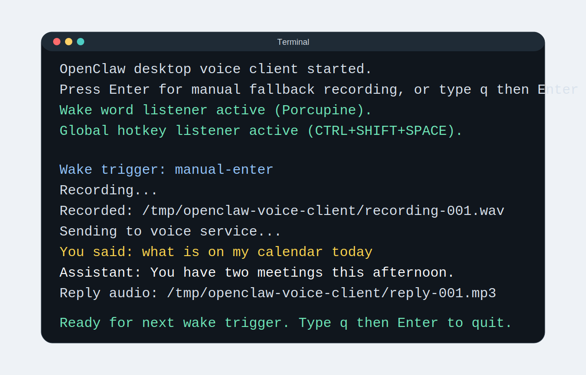

# Desktop Client Walkthrough

Use this guide if you want an always-on command-line client that can listen for a wake word, a hotkey, or a manual Enter key trigger.

If you only want the browser experience, use `docs/user-guide.md` instead.

## Who should use the desktop client

- people who want OpenClaw Voice ready on a desk or mini-PC all day
- people who prefer a wake phrase such as "Hey OpenClaw"
- people who want a fallback hotkey or manual terminal trigger

## Before you start

You need:

- a working OpenClaw Voice server (see `docs/host-it-yourself.md` if you still need to set one up)
- `npm install` already completed (see `docs/host-it-yourself.md` if you have not installed the project packages yet)
- `sox` installed on the desktop machine
- a valid voice bearer token

Optional advanced extras:

- Porcupine wake word files for hands-free triggers
- a local playback command if you want replies to play on the desktop machine
- a Sonos room if replies should route to Sonos

## 1. Confirm the desktop prerequisites

The desktop client records audio with `sox` by default.

- macOS: `brew install sox`
- Ubuntu/Debian: `sudo apt-get update && sudo apt-get install -y sox libsox-fmt-all`
- Windows with Chocolatey: `choco install sox.portable -y`

Success check:

```bash
sox --version
```

## 2. Fill the desktop-related `.env` values

Open `.env` in any plain text editor - Notepad on Windows, TextEdit on macOS, or gedit on Linux. If you cannot find it, make sure hidden files are visible in your file explorer.

Most first-time setups need these values:

- `VOICE_CLIENT_SERVICE_URL=http://127.0.0.1:8787`
- `VOICE_CLIENT_BEARER_TOKEN=replace-with-your-voice-token`
- `VOICE_CLIENT_WAKE_MODE=auto`

Optional but common:

- `VOICE_CLIENT_SESSION_ID=OfficeDesk`
- `VOICE_CLIENT_SONOS_ROOM=Kitchen`
- `VOICE_CLIENT_PLAY_COMMAND` for local reply playback, for example:

```dotenv
# macOS
VOICE_CLIENT_PLAY_COMMAND=afplay "{output}"
# Linux
VOICE_CLIENT_PLAY_COMMAND=mpg123 "{output}"
# Windows
VOICE_CLIENT_PLAY_COMMAND=powershell -NoProfile -Command "Start-Process '{output}'"
```

If you want wake word support, also set:

- `PORCUPINE_ACCESS_KEY`
- `VOICE_CLIENT_PORCUPINE_KEYWORD_PATH`

`Absolute path` means the full file location from the drive root, not a relative path from the current folder.

Example absolute paths:

- macOS/Linux: `/Users/alex/Downloads/Hey-OpenClaw.ppn`
- Windows: `C:\Users\Alex\Downloads\Hey-OpenClaw.ppn`

## 3. Start the desktop client

Run:

```bash
npm run desktop:client
```

Expected startup output looks like this:

```text
OpenClaw desktop voice client started.
Press Enter for manual fallback recording, or type q then Enter to quit.
Wake word listener active (Porcupine).
Global hotkey listener active (CTRL+SHIFT+SPACE).
```

What success looks like:

- you see the startup lines above
- the window stays open waiting for input
- after a voice turn, you see `You said:` and `Assistant:` lines



If you enabled ambient mode, you may also see:

```text
Ambient loop active.
```

## 4. Use it in plain English

### Manual mode

Manual mode means you trigger recording yourself instead of waiting for a wake phrase.

1. Press **Enter**.
2. Speak after `Recording...` appears.
3. Wait for the transcript and reply.

Expected output during a turn:

```text
Wake trigger: manual-enter
Recording...
Recorded: /tmp/openclaw-voice-client/recording-...
Sending to voice service...
You said: what is on my calendar today
Assistant: You have two meetings this afternoon.
Reply audio: /tmp/openclaw-voice-client/reply-...
Ready for next wake trigger. Type q then Enter to quit.
```

### Wake-word mode

Wake-word mode means the client listens for a spoken trigger phrase.

1. Say the configured wake phrase.
2. Wait for the beep.
3. Speak your request.
4. Wait for the response text and optional audio playback.

### Hotkey mode

Hotkey mode means you press a keyboard shortcut instead of saying the wake phrase.

By default the shortcut is `Ctrl+Shift+Space`.

## 5. Stop it cleanly

Type `q` and press Enter.

You can also use `quit` or `exit`.

## Common first-run problems

### Wake word setup unavailable

Plain-English meaning: the client could not start Porcupine.

Check:

- `PORCUPINE_ACCESS_KEY` is present
- `VOICE_CLIENT_PORCUPINE_KEYWORD_PATH` points to a real `.ppn` file
- the file path is absolute, not relative

### Global hotkey setup unavailable

Plain-English meaning: your operating system session is not allowing global keyboard capture.

Try:

- switching to `VOICE_CLIENT_WAKE_MODE=manual`
- using wake-word mode instead
- checking desktop permission prompts on macOS, Linux Wayland, or Windows

### Missing voice token

If startup fails with `Missing VOICE_CLIENT_BEARER_TOKEN`, add `VOICE_CLIENT_BEARER_TOKEN` or reuse `VOICE_API_BEARER_TOKEN` in `.env`.

## Related docs

- Hosting and server setup: `docs/host-it-yourself.md`
- End-user browser guide: `docs/user-guide.md`
- Full environment variable reference: `docs/env-reference.md`
