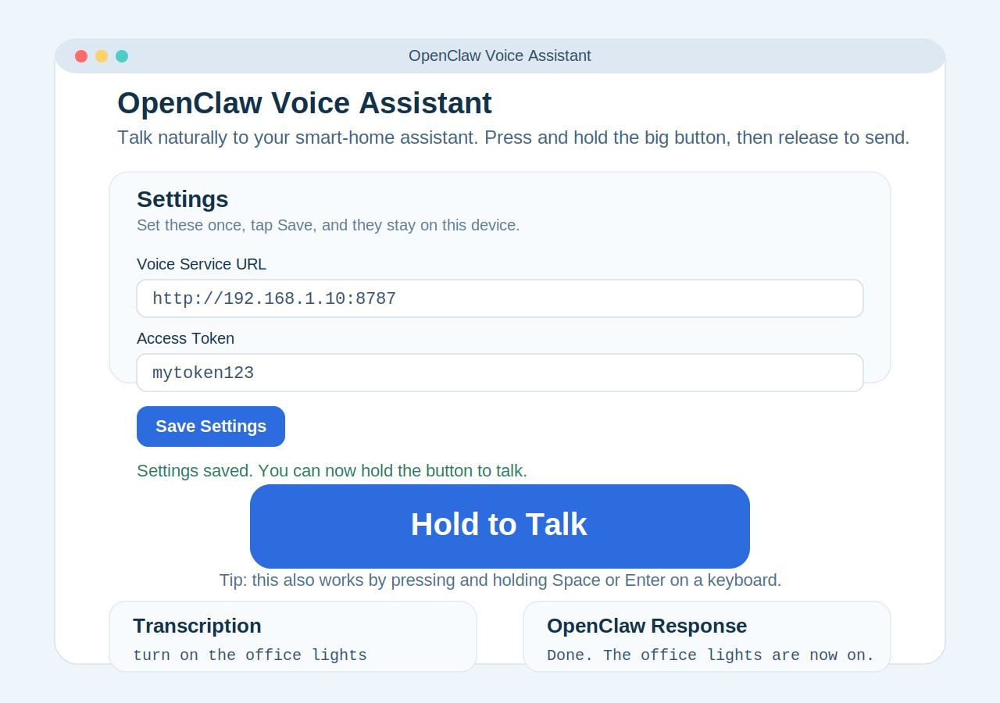

# Host It Yourself

Use this guide if you want to set up and run OpenClaw Voice on your own machine.

> [!IMPORTANT]
> **Not a beginner deployment guide:** This guide is for system operators and technically confident users.
> If you are not technical, share this page with whoever manages your server or network.
> For browser-only use, go to `docs/user-guide.md`.

> [!WARNING]
> **Hard stop prerequisite:** You must already have a working OpenClaw server/API somewhere else.
> This project is OpenClaw Voice, not OpenClaw itself.
>
> If you do not already have an upstream OpenClaw-compatible HTTP API endpoint and (if required) token, stop here and ask the person who manages your OpenClaw server.

> [!CAUTION]
> If you only have a `ws://` address and do not know the matching HTTP API URL, stop here.
> Ask whoever manages your OpenClaw server for the exact HTTP API endpoint before continuing.

## One-screen prerequisites (required before any setup)

Keep this checklist visible while you work:

- [ ] Node.js 20 LTS installed
- [ ] Python 3.10+ installed
- [ ] `ffmpeg` installed
- [ ] Real upstream OpenClaw HTTP API URL ready (not only `ws://`)
- [ ] Upstream OpenClaw API token ready (if your upstream requires one)

> [!WARNING]
> This is not beginner-friendly unless you are comfortable installing software from a terminal and editing config files.
> If you just want to use OpenClaw (not host it), read [the user guide](user-guide.md) instead.

## Common words in this guide

> [!TIP]
> - `terminal`: the text-based app where you run commands (Terminal, PowerShell, Command Prompt).
> - `.env`: a plain text settings file where this project stores URLs and tokens.
> - `PATH`: a system list of folders your computer checks when you type a command like `ffmpeg`.
> - `localhost`: "this same computer" (usually `http://localhost:8787`).
> - `API endpoint`: the exact web address an app accepts for data requests (for example `/api/chat`).
> - `bearer token`: a secret text string sent with a request so a service knows you are allowed in.

## Start here first

Use this guide only if you are the person installing the service.

## Should you continue or stop here?

Use this quick gate before you touch the setup steps:

| Situation | What to do |
| --- | --- |
| You only want to talk to OpenClaw from a browser. | Stop here and open `docs/user-guide.md`. |
| You want to run OpenClaw Voice yourself and you are comfortable copying terminal commands, installing software, editing `.env`, and doing basic troubleshooting. | Stay on this guide. Expect about 30 to 60 minutes for a first run on a new machine. |
| You want the service reachable from another device after local setup works. | Finish this guide first, then continue to `docs/deployment-guide.md`. Expect another 20 to 40 minutes for that deployment step. |

If any of the terminal or config-file tasks above feel too technical, this is the right place to stop and ask whoever hosts OpenClaw Voice for a browser link and token.

- I only want to use an existing OpenClaw Voice link: stop here and open `docs/user-guide.md`
- I want to install and run the service myself: stay here
- I already installed the server and only want the always-on desktop client: use `docs/desktop-client-walkthrough.md`

## Before you touch the terminal

If you are not comfortable with terminal commands, use the browser-only path in `docs/user-guide.md` or ask whoever hosts OpenClaw for your URL and token.

## Zero-knowledge checklist (do this before any commands)

Follow these steps in order. Do not open Terminal, PowerShell, or Command Prompt until step 9 says to.

1. Decide your goal first.
   - If you only want to talk to OpenClaw in a browser, stop now and use `docs/user-guide.md`.
   - Continue only if you will run your own OpenClaw Voice server.
2. Download Node.js 20 LTS.
   - Open <https://nodejs.org/en/download>.
   - Click the **LTS** installer for your operating system.
   - Run the installer and keep default options.
   - Success looks like: installer finishes with no error dialog.
3. Download Python 3.10 or newer.
   - macOS: open <https://www.python.org/downloads/macos/> and run the latest Python 3 installer.
   - Windows: open <https://www.python.org/downloads/windows/>, run the installer, and check **Add python.exe to PATH** before installing.
   - Linux: use your distro package manager if possible.
   - Success looks like: installer/package install finishes with no errors.
4. Download `ffmpeg`.
   - Open <https://ffmpeg.org/download.html>.
   - macOS: click the macOS link, then click **Download as ZIP**.
   - Windows: click **Windows builds from gyan.dev**, then download `ffmpeg-release-essentials.zip`.
   - Linux: install from your distro package manager.
   - Success looks like: file is downloaded (or package manager confirms install complete).
5. Get the OpenClaw Voice project files.
   - Open <https://github.com/brokemac79/openclaw-voice>.
   - Click **Code** -> **Download ZIP**.
   - Extract the ZIP to a folder you can find later (Desktop or Downloads).
   - Success looks like: you can open the extracted folder and see files like `package.json`.
6. Confirm you have upstream OpenClaw connection info.
   - Required: exact upstream HTTP API endpoint URL.
   - Required: whether that upstream API needs an auth token.
   - Required if auth is needed: a valid current token.
7. Prepare your stop points now (do not push through these).
   - Stop and ask for help if you cannot find your extracted project folder.
   - Stop and ask for help if you only have a `ws://` value and no confirmed HTTP API endpoint.
   - Stop and ask for help if you are missing an upstream token that your host says is required.
8. Open a plain text editor you already know how to use.
   - You will use it later for `.env`.
   - Success looks like: you can create and save a plain text file.
9. Now open your command app.
   - macOS: Terminal.
   - Windows: PowerShell or Command Prompt.
   - Linux: your normal terminal app.
   - Continue to the next sections only after all earlier checks are complete.

## I just want voice in my browser

If you are an end user, stop here and use `docs/user-guide.md`.

That browser guide avoids server deployment/operator setup and is the correct non-technical path.

Use the rest of this guide only if you are operating the server yourself.

## Install these first

Do this section before you run any commands.

You do not need every tool on every machine:

- Node.js is required for everyone who hosts the OpenClaw Voice server.
- Python is required for local speech-to-text, which is the normal voice setup in this guide.
- `ffmpeg` is required when you use Python speech-to-text with `faster-whisper`.
- Homebrew and Chocolatey are optional helpers. They are not required. Use them only if you want an easier command-line install method on macOS or Windows.

### Required download checklist

| Tool | Why you need it | macOS | Windows | Linux |
| --- | --- | --- | --- | --- |
| Node.js 20 LTS | Runs the OpenClaw Voice server and installs `npm` at the same time. | Download the LTS installer from <https://nodejs.org/en/download>. | Download the LTS installer from <https://nodejs.org/en/download>. | Use your distribution package manager, or follow the Node.js Linux install options at <https://nodejs.org/en/download/package-manager>. |
| Python 3.10+ | Runs the local speech-to-text helper used by the voice workflow. If you only need the browser page and someone else hosts speech for you, you can skip it. | Download the latest Python 3 release from <https://www.python.org/downloads/macos/>. | Download the latest Python 3 release from <https://www.python.org/downloads/windows/>. During setup, turn on **Add python.exe to PATH**. | Use your distribution package manager, or start at <https://www.python.org/downloads/source/> if your distro does not offer a recent version. |
| `ffmpeg` | Lets `faster-whisper` open common audio formats. Install this before the speech smoke test later in the guide. | Direct download: open <https://ffmpeg.org/download.html>, click the macOS link, then choose **Download as ZIP** on the ffmpeg page. Optional shortcut: Homebrew from <https://brew.sh>, then `brew install ffmpeg`. | Direct download: open <https://ffmpeg.org/download.html>, click **Windows builds from gyan.dev**, then download `ffmpeg-release-essentials.zip`. Optional shortcut: Chocolatey from <https://chocolatey.org/install>, then `choco install ffmpeg -y`. | Use your distribution package manager. The official project keeps Linux links at <https://ffmpeg.org/download.html>. |

### Optional install helpers

- Homebrew: <https://brew.sh>. Use this on macOS only if you prefer copy-and-paste install commands instead of downloading app installers manually.
- Chocolatey: <https://chocolatey.org/install>. Use this on Windows only if you prefer copy-and-paste install commands instead of downloading app installers manually.
- If you are new to this, the simplest path is usually: use the Node.js installer, use the Python installer, then use the `ffmpeg` download page for your platform.

### Before you continue

Confirm all of these before you move on:

- [ ] Node.js 20 or later installed
- [ ] Python 3.10 or later installed if you want local speech-to-text
- [ ] `ffmpeg` installed if you want local speech-to-text
- [ ] OpenClaw is already running somewhere and you have its address
- [ ] A terminal, Command Prompt, or PowerShell window is open

## What this guide covers

- who this guide is for and when to stop
- how to get the project onto your computer
- how to open Terminal or Command Prompt
- how to move into the project folder
- how to fill `.env`
- how to start the voice server
- how to fix the most common first-run errors

## Beginner quick start

### 1. Get the project files

If someone already sent you a ZIP of the project, extract it somewhere easy to find such as your Desktop.

If you are downloading from GitHub:

1. Open <https://github.com/brokemac79/openclaw-voice>.
2. Click **Code**.
3. Click **Download ZIP**.
4. Extract the ZIP.

You can also clone with Git if you already use it:

```bash
git clone https://github.com/brokemac79/openclaw-voice.git
```

### 2. Open a command window

- macOS: open `Terminal`
- Windows: open `Command Prompt`, `PowerShell`, or `Windows Terminal`
- Linux: open your normal terminal app

### 3. Move into the project folder

`cd` means "change directory". It tells the terminal to move into a folder.

Example:

```bash
cd ~/Downloads/openclaw-voice
```

Windows example:

```powershell
cd $HOME\Downloads\openclaw-voice
```

Success check: running `pwd` (macOS/Linux) or `Get-Location` (PowerShell) should show the project folder.

`pwd` prints your current folder path. It should end in the project folder name, for example `/Users/you/Downloads/openclaw-voice`.

### 4. Install Node.js dependencies

Copy and paste this command to install the JavaScript packages this project needs:

```bash
npm install
```

What it does: downloads the packages listed in `package.json`.

Success check: the command finishes without a red error block and creates a `node_modules` folder.

If Windows says `npm` is not recognized, jump to [First-run troubleshooting](#first-run-troubleshooting).

### 5. Create your `.env` file

This file stores the addresses and tokens the app needs.

macOS/Linux:

```bash
cp .env.example .env
```

What it does: makes a new `.env` file by copying the example file.

Windows PowerShell:

```powershell
Copy-Item .env.example .env
```

What it does: makes the same copy on Windows PowerShell.

Then open `.env` in a text editor and fill the values you need.

### How do I find my real OpenClaw URL?

Plain-English rule: `OPENCLAW_URL` is the **HTTP API address that accepts JSON**. It is not the OpenClaw website home page, and it is never `ws://`.

If your setup is not clear yet, follow the path that matches what you have right now.

#### If you only have a websocket address (`ws://...`)

1. Keep the same machine name or IP from the websocket value.
2. Switch the scheme from `ws://` or `wss://` to `http://` or `https://`.
3. Use the OpenClaw chat API path on that same machine (usually `/api/chat`).
4. Test it with `curl` before editing anything else.

Verified end-to-end example:

- OpenClaw startup screen shows: `ws://192.168.1.10:18789`
- Keep host: `192.168.1.10`
- Build API URL: `http://192.168.1.10:3000/api/chat`
- Put in `.env`: `OPENCLAW_URL=http://192.168.1.10:3000/api/chat`

#### If you only have a browser URL

If the only link you have opens a normal web page (for example `http://192.168.1.10:3000/`), that is usually not the API endpoint.

1. Keep the same host.
2. Ask the host/admin for the exact OpenClaw HTTP API endpoint path.
3. Do not guess hidden API paths beyond `/api/chat`.
4. Confirm with `curl` and require a JSON response.

#### If you do not have a token yet

You may need up to two different tokens:

- `VOICE_API_BEARER_TOKEN`: you create this yourself for your OpenClaw Voice server.
- `OPENCLAW_AUTH_BEARER`: optional token from the upstream OpenClaw host, only if their API requires auth.

If the upstream host requires a token and you do not have one, stop and request it before continuing.

#### Stop point (do not continue self-hosting yet)

If you cannot answer all three questions below, stop here and ask your OpenClaw host/admin for help:

1. What is my exact upstream HTTP API endpoint URL?
2. Does that API require a bearer token?
3. If yes, what is the current valid upstream token?

Without those answers, self-hosting cannot continue successfully.

Use this map so each value has one clear source and one clear destination.

| Value | Where it comes from | Exactly where to paste it |
| --- | --- | --- |
| `VOICE_API_BEARER_TOKEN` | You create this value yourself (for example a long random string). | `.env` -> `VOICE_API_BEARER_TOKEN`, and browser **Access Token** when testing at `http://localhost:8787` |
| `OPENCLAW_URL` | The upstream OpenClaw HTTP API endpoint (not the websocket URL). | `.env` -> `OPENCLAW_URL` |
| `OPENCLAW_AUTH_BEARER` (optional) | Token provided by your upstream OpenClaw host/gateway if their API requires auth. | `.env` -> `OPENCLAW_AUTH_BEARER` |

Important token rule:

- `VOICE_API_BEARER_TOKEN` protects **this OpenClaw Voice server**.
- `OPENCLAW_AUTH_BEARER` protects the **upstream OpenClaw API**.
- They can be different. Do not assume one token works for both places.

Before starting the voice server, verify the upstream endpoint directly:

```bash
curl -X POST "http://192.168.1.10:3000/api/chat" \
  -H "Content-Type: application/json" \
  -H "Authorization: Bearer <OPENCLAW_AUTH_BEARER-if-needed>" \
  -d '{"input":"ping"}'
```

Expected result: JSON reply from OpenClaw (not HTML, not 404/405). If this fails, fix `OPENCLAW_URL` first.

At minimum, beginners usually need:

- `VOICE_API_BEARER_TOKEN`
- `OPENCLAW_URL`

Example minimum values:

```env
VOICE_API_BEARER_TOKEN=mytoken123
OPENCLAW_URL=http://192.168.1.10:3000/api/chat
OPENCLAW_METHOD=POST
OPENCLAW_INPUT_FIELD=input
OPENCLAW_OUTPUT_FIELD=response
```

Filled `.env` example with real-looking sample values:

```env
PORT=8787
VOICE_API_BEARER_TOKEN=house-voice-token-9f3a
OPENCLAW_URL=http://192.168.1.10:3000/api/chat
OPENCLAW_METHOD=POST
OPENCLAW_INPUT_FIELD=input
OPENCLAW_OUTPUT_FIELD=response
OPENCLAW_AUTH_BEARER=upstream-token-7b21
FASTER_WHISPER_PYTHON_BIN=python3
FASTER_WHISPER_MODEL=base.en
FASTER_WHISPER_LANGUAGE=en
FASTER_WHISPER_DEVICE=auto
FASTER_WHISPER_COMPUTE_TYPE=int8
FASTER_WHISPER_TIMEOUT_MS=120000
EDGE_TTS_VOICE=en-US-AndrewNeural
TTS_PROVIDER=edge
TTS_FALLBACK_PROVIDER=piper
VOICE_CLIENT_SERVICE_URL=http://127.0.0.1:8787
VOICE_CLIENT_API_PATH=/api/voice/turn
VOICE_CLIENT_BEARER_TOKEN=house-voice-token-9f3a
VOICE_CLIENT_SESSION_ID=OfficeDesk
```

Where those sample values came from:

- You choose: `VOICE_API_BEARER_TOKEN`, `PORT`, and `VOICE_CLIENT_SESSION_ID`
- Your upstream OpenClaw host gives you: `OPENCLAW_URL` and, if required, `OPENCLAW_AUTH_BEARER`
- The guide defaults usually stay as-is: `OPENCLAW_METHOD`, `OPENCLAW_INPUT_FIELD`, `OPENCLAW_OUTPUT_FIELD`, and the `FASTER_WHISPER_*` basics
- The desktop client token usually repeats your own `VOICE_API_BEARER_TOKEN`

If you are testing from the browser at `http://localhost:8787`, the matching filled browser settings would be:

- **Voice Service URL**: `http://localhost:8787`
- **Access Token**: `house-voice-token-9f3a`
- **Session ID**: `OfficeDesk` (optional)
- **Sonos Room**: leave blank unless you set one up

- `VOICE_API_BEARER_TOKEN`: choose any password-like text yourself, such as `mytoken123`. It does not come from a website. It just needs to match anywhere else you enter the same token.
- `OPENCLAW_URL`: this is the upstream HTTP API endpoint. If your upstream only shows `ws://...`, keep the same host and use the matching `http://...` API endpoint (for example `/api/chat`) on that host.

Use `docs/env-reference.md` for what each value means, where to get it, and example values.

### 6. Install the local speech prerequisites

OpenClaw Voice uses local speech-to-text through Python and `faster-whisper`.

Install Python 3.10 or later and check it:

```bash
python3 --version
python3 -m pip --version
```

What it does: confirms Python and pip are available before you install speech-to-text tools.

Success check: `python3 --version` should report Python 3.10 or newer.

Windows PowerShell alternative:

```powershell
py --version
py -m pip --version
```

Create a virtual environment, then activate it with the command that matches your terminal:

macOS/Linux:

```bash
python3 -m venv .venv
source .venv/bin/activate
python3 -m pip install --upgrade pip
```

What it does:

- creates a private Python environment for this project
- turns it on in your current terminal with `source .venv/bin/activate`
- upgrades pip inside that private environment

Windows Command Prompt:

```cmd
py -m venv .venv
.venv\Scripts\activate.bat
py -m pip install --upgrade pip
```

Windows PowerShell:

```powershell
py -m venv .venv
.venv\Scripts\Activate.ps1
py -m pip install --upgrade pip
```

Install `ffmpeg` first, then `faster-whisper`.

No-PATH-edit install route (recommended):

- macOS (Homebrew): `brew install ffmpeg`
- Windows (winget): `winget install --id Gyan.FFmpeg -e`
- Linux: use your distro package manager (`sudo apt install ffmpeg` or `sudo dnf install -y ffmpeg`)

These package-manager installs are the easiest path for non-technical users because they avoid manual PATH editing.

If you cannot use Homebrew/winget, you can still use direct-download builds without editing PATH by running the binary with its full path in commands (examples below).

Direct-download fallback (optional):

1. Open <https://ffmpeg.org/download.html>.
2. Download a build for your platform (macOS static build or Windows gyan.dev essentials build).
3. Extract it somewhere stable that you can find later.
4. Do not edit PATH. Keep the exact location and call `ffmpeg` by full path when needed.

If macOS blocks the binary, remove quarantine from the extracted files:

```bash
xattr -dr com.apple.quarantine /path/to/ffmpeg /path/to/ffprobe
```

Linux shortcut:

- Ubuntu/Debian: `sudo apt install ffmpeg`
- Fedora/RHEL: `sudo dnf install -y ffmpeg`

Then:

```bash
python3 -m pip install faster-whisper
```

What it does: installs the speech-to-text package OpenClaw Voice uses.

Windows alternative:

```powershell
py -m pip install faster-whisper
```

Success checks:

```bash
ffmpeg -version
```

What it does: confirms `ffmpeg` is installed and reachable from your terminal.

If the terminal still says `ffmpeg` is not found:

- use the full-path command once to confirm the binary itself works.
- if full-path works but plain `ffmpeg` does not, continue setup and use the full path for smoke-test commands.

Windows full-path test:

```powershell
& "C:\ffmpeg\ffmpeg-8.1-essentials_build\bin\ffmpeg.exe" -version
```

macOS full-path test:

```bash
/usr/local/bin/ffmpeg -version
```

If the full-path test works, the install is fine and only your `PATH` needs attention.

Make a small test audio file yourself so you do not need a pre-existing `test.wav`:

```bash
ffmpeg -f lavfi -i "anullsrc=r=16000:cl=mono" -t 2 test.wav
```

Windows no-PATH alternative:

```powershell
& "C:\ffmpeg\ffmpeg-8.1-essentials_build\bin\ffmpeg.exe" -f lavfi -i "anullsrc=r=16000:cl=mono" -t 2 test.wav
```

macOS no-PATH alternative:

```bash
/full/path/to/ffmpeg -f lavfi -i "anullsrc=r=16000:cl=mono" -t 2 test.wav
```

What it does: creates a 2-second silent WAV file named `test.wav` in the project folder.

Now run the speech-to-text smoke test:

```bash
python3 scripts/faster_whisper_transcribe.py --audio-path test.wav --model base.en
```

What it does: runs the local transcription helper against the test file you just created.

Success output should include JSON with keys like `text`, `language`, and `duration`.

### 7. Start the server

Copy and paste this command to start the local web server:

```bash
npm run dev
```

What it does: starts OpenClaw Voice on your computer.

Success check: you should see a line like this:

```text
openclaw-voice server listening on :8787
```

Then open `http://localhost:8787` in your browser.

`localhost` means "this same computer." It is a safe local-only address used for software running on your machine.

If local setup works and you now want the app to stay running or open from another device, continue to `docs/deployment-guide.md`.

## Recommended first validation

1. Check the health endpoint:

   ```bash
   curl http://localhost:8787/health
   ```

   Expected result:

   ```json
   {"ok":true}
   ```

2. Open the browser page.
3. Allow microphone access.
4. Paste your voice token.
5. Hold **Hold to talk**, speak, and release.

What success looks like:

- the **Hold to Talk** button is enabled
- your words appear under **Transcription**
- the OpenClaw reply appears on screen



## First-run troubleshooting

### `npm` not found

Diagnosis: Node.js is not installed, or your terminal cannot find it yet.

Fix:

1. Install Node.js 20+ from <https://nodejs.org/>.
2. Fully close and reopen the terminal.
3. Run `node --version` and `npm --version`.

### `python3` not found

Diagnosis: Python 3 is not installed, or Windows uses `py` instead of `python3`.

Fix:

1. Install Python 3 from <https://www.python.org/downloads/>.
2. On Windows, try `py --version`.
3. Reopen the terminal after install.

### `ffmpeg` not found

Diagnosis: `ffmpeg` is either missing, or installed but not added to your terminal `PATH` yet.

Fix:

1. Install `ffmpeg` for your platform if you have not already.
2. Reopen the terminal completely.
3. Run `ffmpeg -version` again.
4. If it still fails, test the full binary path directly.
5. If the full binary path works, fix your `PATH` entry instead of reinstalling.

### Microphone permission denied

Diagnosis: your browser or operating system blocked microphone access.

Fix:

1. Open browser site permissions for the OpenClaw Voice page.
2. Change microphone access to **Allow**.
3. Reload the page.
4. On macOS or Windows, also check the system privacy settings if the browser still cannot record.

### Invalid URL or bad endpoint

Diagnosis: `OPENCLAW_URL` points at the wrong place.

Plain-English rule: use the real HTTP API address, not a website home page and not a `ws://` websocket address. If OpenClaw shows you a `ws://` address at startup, use that to identify the right machine, then switch to the matching HTTP API endpoint. For example, `ws://192.168.1.10:18789` often maps to `http://192.168.1.10:3000/api/chat`.

Fix:

1. Make sure `OPENCLAW_URL` starts with `http://` or `https://`.
2. Make sure it points at the chat API path, such as `/api/chat`.
3. If you get `404`, the path is usually wrong.
4. If you get `405`, the endpoint usually does not accept the configured HTTP method.

### Token rejected or authentication failed

Diagnosis: the bearer token is blank, wrong, expired, or meant for a different service.

`Bearer token` means a secret access string sent with your request so the service knows you are allowed to use it.

Fix:

1. Paste the token again exactly.
2. Confirm you put it in the correct variable.
3. Generate a fresh token if your upstream service rotates them.
4. Restart the server after editing `.env`.

## Where to go next

- Just want to use the web app: `docs/user-guide.md`
- Want it reachable from another device with a real deployment path: `docs/deployment-guide.md`
- Want the always-on desktop client: `docs/desktop-client-walkthrough.md`
- Need every environment variable explained: `docs/env-reference.md`
